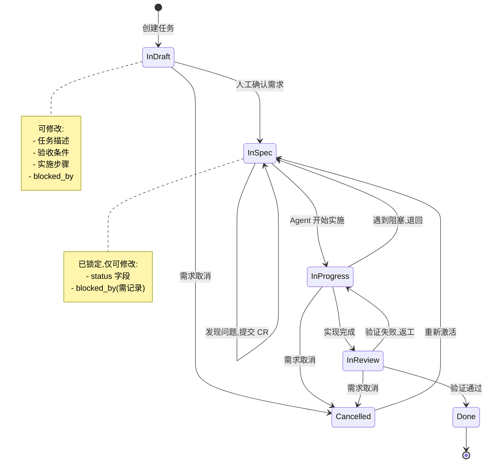
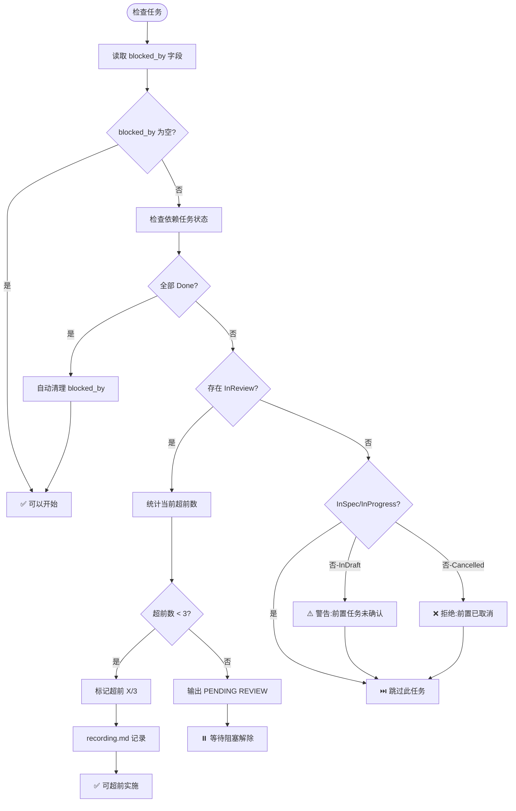
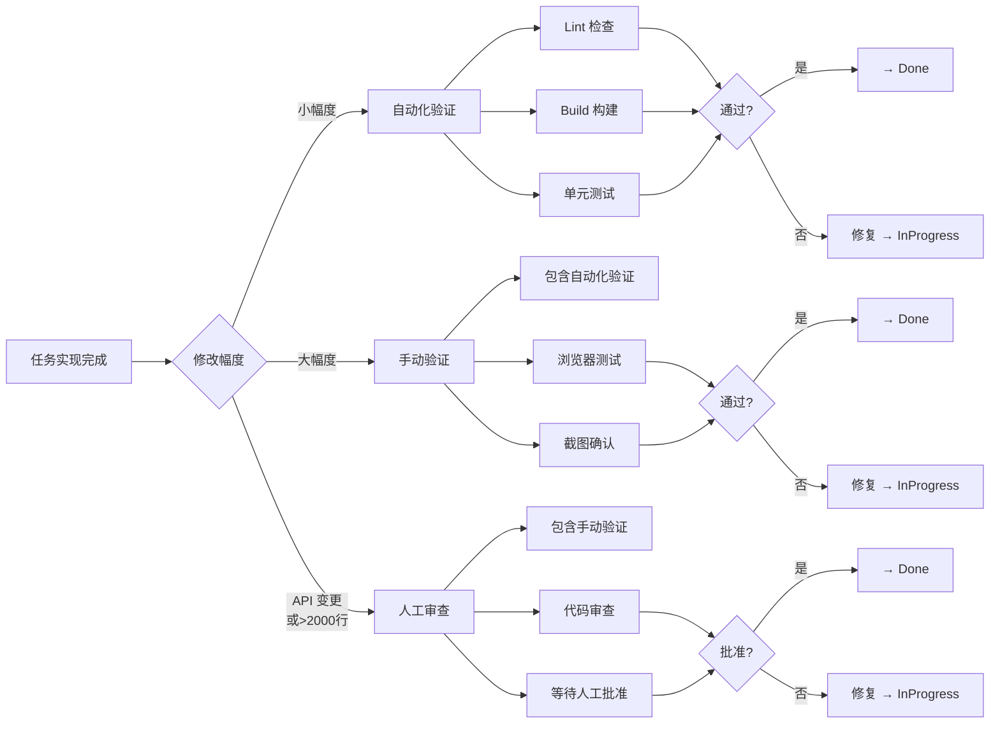

# diwu-init Skill

[](https://github.com/ssdiwu/diwu-init/stargazers)
[](https://github.com/ssdiwu/diwu-init/network/members)
[](https://github.com/ssdiwu/diwu-init/blob/main/LICENSE)
[](https://github.com/ssdiwu/diwu-init/issues)


一个用于初始化项目 Claude Code Agent 工作流结构的 Skill,自动创建符合规范的项目配置文件。

## 概述

`diwu-init` 基于约束驱动的设计理念,为新项目或现有代码库搭建完整的 Agent 工作流体系,包括:

- **状态外置**: 任务状态、进度记录存储在文件中,支持跨 session 恢复
- **原子化 Session**: 每个 session 有明确的启动、执行、结束流程
- **严格验收**: 任务验收条件可证据化验证
- **可中断可恢复**: 支持任务阻塞、超前实施、Change Request 等场景

## 核心工作流

### 任务状态机



### Session 生命周期

```mermaid
flowchart TD
    Start([Session 启动]) --> Preflight[1. Preflight 检查]
    Preflight --> Smoke{smoke.sh 存在?}
    Smoke -->|是| RunSmoke[运行基线验证]
    Smoke -->|否| CheckCR[检查 CR]
    RunSmoke --> CheckCR

    CheckCR --> GitStatus[运行 git status]
    GitStatus --> Context[2. 上下文恢复]

    Context --> ReadRecording[读取 recording.md]
    ReadRecording --> GitLog[运行 git log -20]
    GitLog --> SelectTask[3. 选择任务]

    SelectTask --> ReadTasks[读取 task.json]
    ReadTasks --> CheckInProgress{存在 InProgress?}

    CheckInProgress -->|是| ResumeTask[恢复中断任务]
    CheckInProgress -->|否| FindInSpec[查找 InSpec 任务]

    FindInSpec --> CheckBlocked{检查 blocked_by}
    CheckBlocked -->|无阻塞| CanStart[可开始]
    CheckBlocked -->|全部 Done| CanStart
    CheckBlocked -->|有 InReview<br/>且超前<3| CanAdvance[可超前实施]
    CheckBlocked -->|其他| SkipTask[跳过,选择下一个]

    SkipTask --> FindInSpec

    CanStart --> InitEnv[4. 初始化环境]
    CanAdvance --> MarkAdvance[标记超前]
    ResumeTask --> InitEnv
    MarkAdvance --> InitEnv

    InitEnv --> RunInit{需要运行 init.sh?}
    RunInit -->|是| ExecInit[运行 init.sh]
    RunInit -->|否| RunBaseline[运行基线测试]
    ExecInit --> RunBaseline

    RunBaseline --> BaselineOK{基线通过?}
    BaselineOK -->|否| FixBaseline[修复基线问题]
    FixBaseline --> RunBaseline
    BaselineOK -->|是| Implement[5. 实施任务]

    Implement --> SetInProgress[状态 → InProgress]
    SetInProgress --> ReadTask[读取任务详情]
    ReadTask --> CodeImpl[按验收条件实现]
    CodeImpl --> Verify[按 testing.md 验证]

    Verify --> VerifyOK{验证通过?}
    VerifyOK -->|否| Blocked{遇到阻塞?}
    Blocked -->|是| RecordBlock[记录阻塞原因]
    RecordBlock --> SetInSpec[状态 → InSpec]
    SetInSpec --> OutputBlock[输出 BLOCKED 信息]
    OutputBlock --> End

    Blocked -->|否| CodeImpl

    VerifyOK -->|是| SetInReview[状态 → InReview]
    SetInReview --> CheckScope{修改幅度}

    CheckScope -->|小幅度| AgentReview[Agent 自审]
    CheckScope -->|大幅度| HumanReview[请求人工审查]

    AgentReview --> SetDone[状态 → Done]
    HumanReview --> WaitApproval[等待人工确认]
    WaitApproval --> SetDone

    SetDone --> UpdateRecording[6. 更新 recording.md]
    UpdateRecording --> GitCommit[提交 Git]
    GitCommit --> CheckArchive{需要归档?}

    CheckArchive -->|task.json<br/>Done>20| ArchiveTask[归档到 task_archive.json]
    CheckArchive -->|recording.md<br/>跨月| ArchiveRecording[归档到 YYYY-MM.md]
    CheckArchive -->|否| End([Session 结束])

    ArchiveTask --> End
    ArchiveRecording --> End
```



### blocked_by 依赖处理



## 目录结构

```
diwu-init/
├── SKILL.md                    # Skill 操作指南
├── README.md                   # 本文件
│
├── assets/                     # 项目模板文件
│   ├── agents-md.template      # AGENTS.md 模板
│   ├── claude-md.template      # 通用 CLAUDE.md 模板
│   ├── claude-md-minimal.template    # 精简模式模板
│   ├── claude-md-portable.template   # 便携模式模板
│   ├── init.sh.template        # 环境初始化脚本模板
│   ├── recording.md.template   # 进度记录模板
│   ├── smoke.sh.template       # 基线验证脚本模板
│   ├── task.json.template      # 任务跟踪模板
│   │
│   └── rules/                  # 内置规则文件(便携模式用,约 688 行)
│       ├── core-states.md      # task.json 结构、状态机、blocked_by 规范(~137 行)
│       ├── core-workflow.md    # Session 流程、任务规划、实施、验证要求(~243 行)
│       ├── exceptions.md       # 阻塞、Change Request、超前实施、回退处理(~106 行)
│       ├── templates.md        # 所有格式模板、Git 规范、可调参数(~157 行)
│       └── file-layout.md      # 所有文件路径定义、目录结构、归档触发条件(~45 行)
│
└── references/                 # 参考文档
    ├── constraint-template.md  # 架构约束模板
    └── memory-best-practices.md    # CLAUDE.md 最佳实践
```

## 配置模式

### 精简模式 (Minimal Mode)

**适用场景**: 个人项目,用户已配置 `~/.claude/rules/`

**优势**:
- 文件体积小
- 易于维护(全局规则集中更新)
- 避免规则重复

**生成的 .claude/CLAUDE.md**:
```markdown
# [项目名称]

## 工作流
遵循全局 `~/.claude/rules/` 中定义的 diwu 工作流。

## 项目上下文
[项目特定信息...]
```

### 便携模式 (Portable Mode)

**适用场景**: 分享给他人、独立项目、团队协作

**优势**:
- 项目自包含,无外部依赖
- 适合分发和版本控制
- 不依赖 `~/.claude/rules/`

**生成的 .claude/CLAUDE.md**:
```markdown
# [项目名称]

## 项目上下文
[项目特定信息...]

## 工作流规则

### 任务状态机与字段定义
[完整嵌入 core-states.md 内容]

### Session 工作流
[完整嵌入 core-workflow.md 内容]

### 异常处理
[完整嵌入 exceptions.md 内容]

### 格式模板
[完整嵌入 templates.md 内容]

### 文件布局
[完整嵌入 file-layout.md 内容]
```

**规则文件详情**:

| 规则文件 | 职责 | 行数 |
|---------|------|------|
| `core-states.md` | task.json 结构与字段定义、状态机与转移规则、blocked_by 规范 | ~137 行 |
| `core-workflow.md` | Session 流程、任务规划、实施、验证要求 | ~243 行 |
| `exceptions.md` | 阻塞、Change Request、超前实施、回退处理 | ~106 行 |
| `templates.md` | 所有格式模板、Git 规范、可调参数 | ~157 行 |
| `file-layout.md` | 所有文件路径定义、目录结构、归档触发条件 | ~45 行 |

**总计**: 约 688 行工作流规则

## task.json 结构

### 字段说明

```json
{
  "tasks": [
    {
      "id": 1,
      "description": "一句话描述任务内容",
      "status": "InDraft",
      "acceptance": [
        "可验证的验收标准1",
        "可验证的验收标准2"
      ],
      "steps": [
        "实施过程的关键步骤1",
        "实施过程的关键步骤2"
      ],
      "category": "functional",
      "blocked_by": [2, 3]
    }
  ]
}
```

**字段定义**:
- `id`: 任务唯一标识,从 1 开始递增,永不复用
- `description` (任务描述): 一句话描述任务内容
- `status`: 任务状态(InDraft/InSpec/InProgress/InReview/Done/Cancelled)
- `acceptance` (验收条件): 可验证的验收标准数组
- `steps` (实施步骤): 实施过程的关键步骤数组
- `category`: 任务分类(functional/ui/bugfix/refactor/infra)
- `blocked_by`: (可选)阻塞当前任务的前置任务 ID 数组

### blocked_by 字段规范

**语义**: 表示阻塞关系,前置任务未完成则当前任务无法开始

**修改权限**:
| 状态 | 可修改 blocked_by? | 要求 |
|------|------------------|------|
| InDraft | ✅ 是 | 自由修改 |
| InSpec | ✅ 是 | 需在 recording.md 记录原因 |
| InProgress 及之后 | ❌ 否 | 只能通过 Change Request |

**自动清理**: 当 blocked_by 中的任务变为 Done 时,Agent 自动移除该 ID

**合法性检查**:
1. 引用存在: blocked_by 中的 ID 必须存在于 task.json 或 task_archive.json
2. 无循环依赖: 不存在 A→B→C→A 的循环
3. 非自引用: 任务不能阻塞自己
4. 状态合理:
   - ✅ InSpec/InProgress/InReview
   - ⚠️ InDraft → 警告并提示先确认前置任务
   - ❌ Done → 提示在任务描述中说明即可
   - ❌ Cancelled → 拒绝

## recording.md 结构

### Session 记录格式

```markdown
# Session 记录

## Session 2026-02-17 14:30

### 上下文恢复
- 上次任务: Task#1 (InProgress)
- Git status: clean
- 待处理 CR: 无

### Task#1: 用户登录功能 → Done

**实施内容**:
- 实现了 login API 调用
- 添加了 token 存储逻辑
- 实现了错误提示 UI

**验收验证**:
- [x] 输入正确用户名密码后跳转到首页
- [x] 输入错误密码显示错误提示
- [x] 登录状态保持 7 天

**验证方法**: 手动验证
- 测试账号: test@example.com / password123
- 正确登录 → ✅ 跳转到 /dashboard
- 错误密码 → ✅ 显示 "密码错误"
- LocalStorage → ✅ token 存在,expires 7 天后

**提交**: commit abc123f

### 下一步
- Task#2: 实现用户个人资料页面 (InSpec, blocked_by Task#1 已解除)
```

### Change Request 记录格式

```markdown
## Session 2026-02-18 09:00

### Task#5: 订单列表分页 → InSpec (等待 CR 批准)

**Change Request #1**:
- 发现问题: 原验收条件 "支持无限滚动" 与后端 API 设计冲突(后端仅支持分页)
- 建议修改:
  - [删除] "支持无限滚动加载"
  - [新增] "支持分页加载,每页 20 条"
  - [新增] "显示页码和总页数"
- 影响评估: 需额外 2 小时实现分页 UI
- 状态: 等待人工批准
```

## 验证方法

### 三种验证方式



**修改幅度判定**:
- **小幅度**: Lint + Build + 单元测试,Agent 自审
- **大幅度**: 需浏览器测试,Agent 自审
- **超大幅度**: 满足以下任一条件,需人工审查
  - 修改了原有的 API 规范或字段定义
  - 单次任务修改代码行数超过 2000 行

## 使用示例

### 初始化新项目

```bash
# 1. 创建项目目录
mkdir my-project && cd my-project

# 2. 在 Claude Code 中调用 skill
# (Claude Code 会询问项目信息)

# 3. 生成的文件结构
tree -a -L 3
# .
# ├── .claude/
# │   ├── CLAUDE.md
# │   ├── task.json
# │   ├── recording.md
# │   └── checks/
# │       └── smoke.sh
# ├── AGENTS.md
# └── init.sh

# 4. 初始化环境
./init.sh

# 5. 开始任务实施
# Agent 会自动读取 task.json 并开始第一个 InSpec 任务
```

### 为现有项目添加工作流

```bash
# 1. 进入现有项目
cd existing-project

# 2. 在 Claude Code 中调用 skill
# 选择 "便携模式" 以便独立分发

# 3. 检查生成的文件
ls .claude/
# CLAUDE.md  task.json  recording.md  checks/

# 4. 提交到版本控制
git add .claude/ AGENTS.md init.sh
git commit -m "Add Claude Code workflow structure"
```

## 架构约束(可选)

对于架构复杂的项目,可以创建 `.claude/rules/constraints.md` 使用五维框架定义约束:

```markdown
# [模块名称] 架构约束

## 约束

| 维度 | 约束 | 验证问题 |
|------|------|----------|
| 业务约束 | 用户 ID 全局唯一,不可修改 | "100 年后还成立吗?" |
| 时序约束 | 订单状态: 待支付→已支付→已发货→已完成 | "能绕过这个状态转移吗?" |
| 跨平台约束 | iOS/Android 购物车数量必须一致 | "两端不同是 bug 吗?" |
| 并发约束 | 库存扣减必须使用数据库锁 | "两个线程同时做会出问题吗?" |
| 感知约束 | API 响应时间 > 3 秒需显示加载提示 | "超过阈值用户会注意到吗?" |

## 状态机

[定义关键业务流程的状态转移规则]
```

## 最佳实践

### CLAUDE.md 编写指南

1. **要具体,不要抽象**:
   - ✅ "使用 2 空格缩进"
   - ❌ "正确格式化代码"

2. **包含所有常用命令**:
   ```markdown
   ## 常用命令

   ```bash
   # 开发
   npm run dev

   # 构建
   npm run build

   # 检查
   npm run lint

   # 测试
   npm run test
   ```
   ```

3. **使用 @import 引用外部文档**:
   ```markdown
   ## API 规范

   详见 @docs/api-spec.md
   ```

4. **记录命名约定和代码风格**:
   ```markdown
   ## 编码约定

   - TypeScript strict mode
   - 函数式组件 + hooks
   - 文件名: kebab-case
   - 组件名: PascalCase
   ```

### 任务分解原则

1. **粒度标准**: 预估修改代码 < 2000 行
2. **验收可证**: 验收条件必须可验证,避免主观判断
3. **依赖明确**: 使用 blocked_by 标注依赖关系
4. **步骤清晰**: 实施步骤可指导实现过程

### Session 管理建议

1. **启动时**: 严格执行 Preflight 检查,确保环境正常
2. **实施中**: 遇到阻塞立即记录,不要假装完成
3. **结束时**: 更新 recording.md,记录下一步建议
4. **Context Window**: 不要因 token 预算提前停止,系统会自动压缩

## 相关资源

- [Claude Code 官方文档](https://code.claude.com/docs/zh-CN/memory.md)
- [diwu 全局规则](~/.claude/rules/)
- [diwu 全局规则](~/.claude/rules/)

## License

MIT
